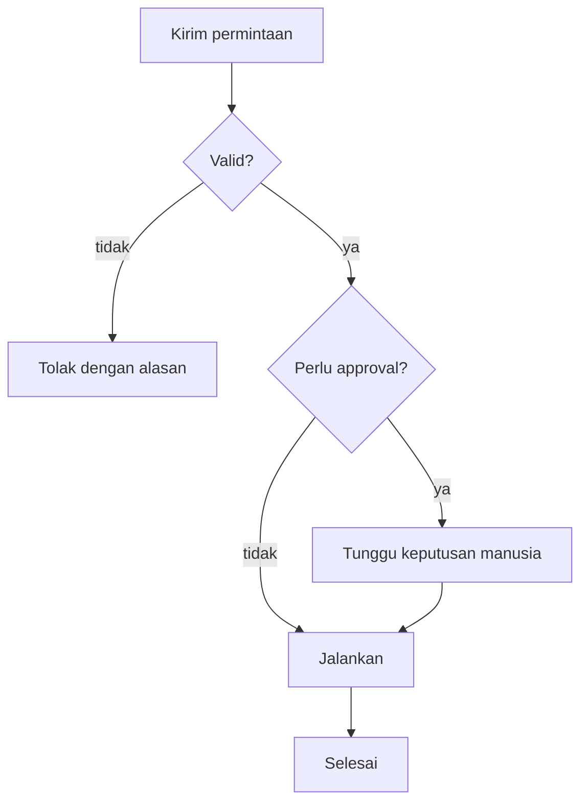

# Emit structure as a `mermaid` block

## Kapan dipakai

Pakai saat yang dijelaskan adalah **hubungan antar hal**, dan hubungan itu
sulit diikuti dalam kalimat: percabangan alur, urutan pesan antar
komponen, transisi state, relasi entitas, hierarki.

Jangan pakai untuk daftar berurutan sederhana — daftar bernomor lebih
mudah dibaca dan lebih murah. Jangan pakai untuk data kuantitatif; itu
`tag-chart`.

## Bentuk

Blok berpagar dengan info string `mermaid` — bukan `diagram`. Tag ini
sudah standar de facto dan renderer di mana-mana sudah mengenalinya.

````

````

Jenis yang dipakai paling sering: `flowchart` (alur dan percabangan),
`sequenceDiagram` (urutan pesan antar aktor), `stateDiagram-v2` (transisi
state), `erDiagram` (relasi entitas), `classDiagram` (struktur tipe).

## Aturan

**ID node netral bahasa, label ikut bahasa percakapan.** ID (`submit`,
`validate`) adalah identifier; teks dalam kurung yang dibaca manusia.
Diagram yang sama diterjemahkan dengan mengganti label saja.

**Jangan pakai `click`.** Direktif itu menautkan atau memanggil callback
di browser pembaca, dan renderer yang aman menolaknya. Kalau sebuah node
perlu tautan, tulis tautannya di prosa setelah blok.

**Jangan menyisipkan HTML di label.** Sebagian konfigurasi Mermaid
mengizinkannya; renderer yang benar tidak. Label adalah teks polos.

**Tanda kutip untuk label yang memuat karakter khusus.** Kurung, koma,
titik dua, dan `-` di dalam label mematahkan parser kecuali dibungkus
`["..."]`.

**Batasi sekitar 15-20 node.** Di atas itu diagram jadi tidak terbaca di
lebar chat. Pecah jadi beberapa diagram menurut lapisan atau fase, atau
simpan sebagai artefak.

**Arah yang konsisten.** `TD` untuk alur dan hierarki, `LR` untuk pipeline
dan lini masa. Mencampurnya dalam satu jawaban membuat pembaca kehilangan
orientasi.

## Setelah blok

Satu-dua kalimat yang menunjuk **jalur yang penting** — cabang mana yang
biasa terjadi, di mana letak keputusannya. Bukan penyebutan ulang tiap
node.
