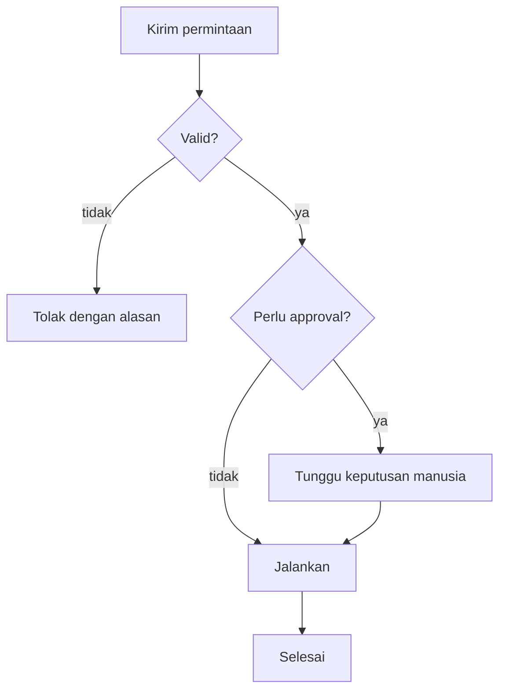

# Emit structure as a `mermaid` block

## When to use it

Use it when what is being explained is **the relationships between things**,
and those relationships are hard to follow in sentences: branching flows, the
order of messages between components, state transitions, entity
relationships, hierarchies.

Don't use it for a simple ordered list — a numbered list reads more easily and
costs less. Don't use it for quantitative data; that is `tag-chart`.

## The shape

A fenced block with the info string `mermaid` — not `diagram`. That tag is
already a de facto standard and renderers everywhere recognise it.

````

````

(The example's labels are Indonesian on purpose while its node IDs stay
language-neutral — the rule below.)

The most frequently used kinds: `flowchart` (flows and branching),
`sequenceDiagram` (the order of messages between actors), `stateDiagram-v2`
(state transitions), `erDiagram` (entity relationships), `classDiagram` (type
structure).

## The rules

**Node IDs are language-neutral, labels follow the conversation's language.**
An ID (`submit`, `validate`) is an identifier; the text in brackets is what a
human reads. Translating the same diagram means changing only its labels.

**Don't use `click`.** That directive links out or invokes a callback in the
reader's browser, and a safe renderer refuses it. If a node needs a link,
write that link in the prose after the block.

**Don't embed HTML in labels.** Some Mermaid configurations allow it; a
correct renderer doesn't. Labels are plain text.

**Quote labels containing special characters.** Brackets, commas, colons, and
`-` inside a label break the parser unless wrapped in `["..."]`.

**Keep it to around 15-20 nodes.** Beyond that a diagram becomes unreadable at
chat width. Split it into several diagrams by layer or phase, or store it as
an artifact.

**Consistent direction.** `TD` for flows and hierarchies, `LR` for pipelines
and timelines. Mixing them within one answer disorients the reader.

## After the block

One or two sentences pointing at **the path that matters** — which branch is
the common one, where the decision sits. Not a re-listing of every node.
